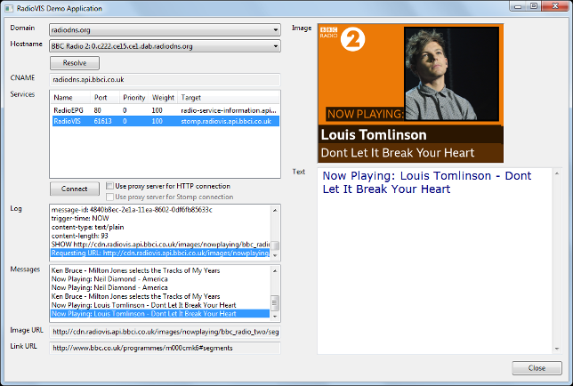

[](https://travis-ci.org/bbc/RadioVisDemo)

# RadioVIS Demo Application

<p align="center">
  <a href="https://github.com/bbc/RadioVISDemo"></a>
</p>

## Introduction

RadioVisDemo is a demonstration application for RadioDNS and RadioVIS. RadioVIS
is the visualisation protocol that forms part of the RadioDNS suite of
application protocols, also known as Hybrid Digital Radio (DAB, DRM, RadioDNS)
Slideshow, defined in the following ETSI standards:

* [ETSI TS 103 270 v1.3.1 - RadioDNS Hybrid Radio; Hybrid lookup for radio services](https://www.etsi.org/deliver/etsi_ts/103200_103299/103270/01.03.01_60/ts_103270v010301p.pdf)
* [ETSI TS 101 499 v3.1.1 - Slideshow](http://www.etsi.org/deliver/etsi_ts/101400_101499/101499/03.01.01_60/ts_101499v030101p.pdf)

Please visit <https://radiodns.org> for more information about RadioDNS, and
<https://www.bbc.co.uk/rd/projects/radiovis> to learn more about this project,
and <https://github.com/bbc/RadioVisDemo> to obtain the latest release of this
software.

## Installation

RadioVisDemo is a Python application and requires several dependencies to be
installed.

### Ubuntu

On Ubuntu, install Python 3, pip, and the GTK development libraries, then
use pip to install the dependencies:

```bash
sudo apt-get install python3 python3-pip libgtk-3-dev
pip3 install -r requirements.txt
```

Alternatively, you may be able to install a pre-compiled version of wxPython:

```bash
sudo apt-get install python3 python3-pip python-wxgtk4.0
pip3 install -r requirements-ubuntu.txt
```

### Windows

On Windows, download and install Python v3.5 or later from
<http://www.python.org/download/>, then use pip to install the required
packages:

```bash
pip install -r requirements.txt
```

### Mac OSX

On Mac, you can use pip to install the required packages:

```bash
pip install -r requirements.txt
```

# Running RadioVisDemo

To run the application, enter the following at a command prompt:

```bash
python3 radiovis_demo.py
```

The default setting in the **Domain** field is `radiodns.org`. Change this option
to perform radio station DNS lookups against a different domain, which is useful
for testing RadioDNS services during development.

Select a RadioDNS hostname in the **Hostname** field. The **Local Stomp Server** entry
allows testing of a RadioVIS service running on the local machine (localhost,
port 61613).

Press the **Resolve** button to perform a DNS CNAME lookup on the selected hostname
and then an SRV record query for available RadioDNS services (RadioVIS, RadioTAG,
and RadioEPG). The results are shown in the **CNAME** and **Services** fields.

If a RadioVIS service is available, select this from the **Services** list and press
the **Connect** button. The options next to the **Connect** button allow HTTP requests
and the Stomp connection to be routed through an HTTP proxy. Proxy settings are
obtained from the `urllib.getproxies()` method, which returns the system proxy
settings (the `http_proxy` environment variable or Internet Explorer settings in
Windows). A proxy server should not be used if connecting to a service on the
local machine.

Once connected, the following fields show information received from the RadioVIS
service:

 * The **Log** field shows status messages and details of all Stomp messages
   received.

 * The **Messages** field shows the history of received RadioVIS TEXT messages.

 * The **Image URL** field shows the URL of the image from the last received
   RadioVIS SHOW message.

 * The **Link URL** field shows the hyperlink from the last received RadioVIS SHOW
   message.

 * The **Image** field shows the image from the last received RadioVIS SHOW message.

 * The **Text** field displays the last received RadioVIS TEXT message.

## Configuration

The RadioVIS demo application uses several configuration files, in the `conf`
directory:

### radiodns_domains.xml

This file contains a list of domains against which DNS lookups
for radio stations can be performed. By default, this list includes
`radiodns.org` (for live services) and `test.radiodns.org` (for test purposes),
but you can modify this list to refer to your own domain in order to test
your own RadioDNS services before making them available via radiodns.org.

### radio_stations.xml

This file contains a list of radio stations and their associated
broadcast parameters, which are shown in the **Hostname** field. Please read
the [RadioDNS documentation](http://radiodns.org/) for details of the
broadcast parameters.

If you'd like to add your radio station's details to this least, please
send us a pull request.

### radiodns_services.xml

This file contains a list of the RadioDNS services and SRV
record names, which are queried when the **Resolve** button is pressed. At
present these are RadioVIS, RadioTAG, and RadioEPG.

### test_radiovis_services.xml

This file contains a list of test RadioVIS services that
the application can connect to. Each `test_radiovis_service` element should
contain the following entries:

 * `name`: The name of the test service name, for display in the user interface.

 * `hostname`: The hostname of the computer that runs the RadioVIS Stomp
   service.

 * `port`: The port number of the RadioVIS Stomp service.

 * `text_topic`: The topic name for text message notifications.

 * `image_topic`: The topic name for slideshow image notifications.

## Tests

The `test` directory contains unit tests. To run the tests use the following
command:

```bash
nosetests
```

## Limitations

This software has a few limitations:

 * The software uses the system proxy server settings (the `http_proxy`
   environment variable or Internet Explorer settings in Windows), and these
   are not configurable within the program.

 * In the handling of RadioVIS SHOW messages, the trigger time is not used,
   and the image is always shown immediately.

 * Error and redirect statuses are not handled when retrieving images over HTTP.

 * STOMP connections cannot be routed via a SOCKS proxy (fixing this requires
   changes to the stomp.py module).

## Authors

This software was written by [Chris Needham](https://github.com/chrisn) - chris.needham at bbc.co.uk.

## Contact and Legal Information

Copyright 2009-2020 British Broadcasting Corporation

The RadioVIS Demo Application is free software; you can redistribute it and/or
modify it under the terms of the Apache License, Version 2.0.

The RadioVIS Demo Application is distributed in the hope that it will be useful,
but WITHOUT ANY WARRANTY; without even the implied warranty of MERCHANTABILITY
or FITNESS FOR A PARTICULAR PURPOSE.  See the Apache License, Version 2.0 for
more details.

Your comments and suggestions are welcome. Please visit
[our website](https://www.bbc.co.uk/rd/projects/radiovis) or send email to
irfs@bbc.co.uk.
